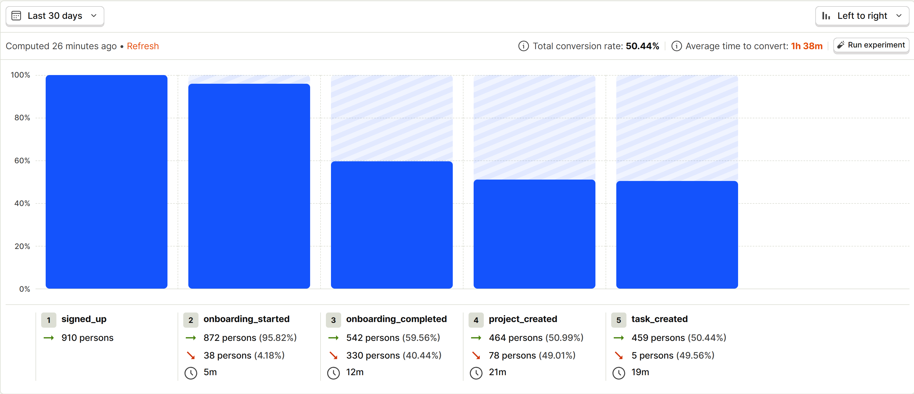
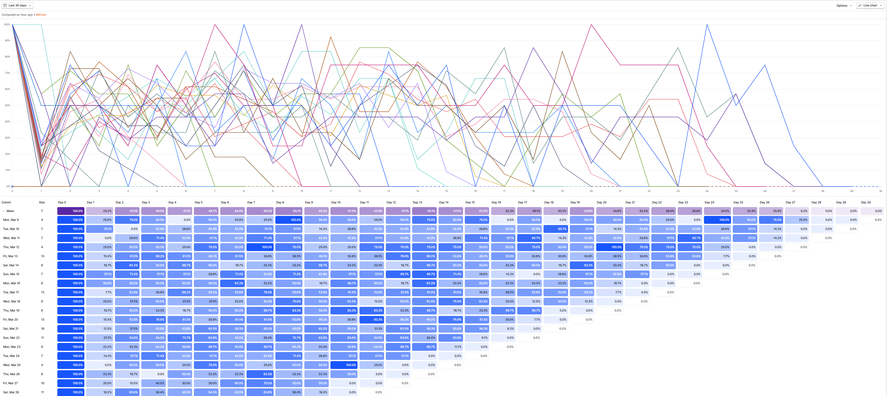
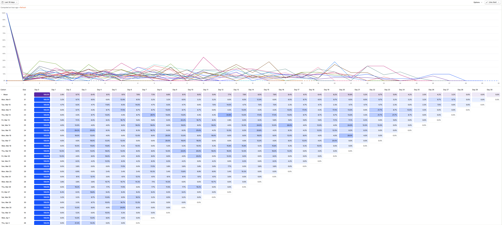
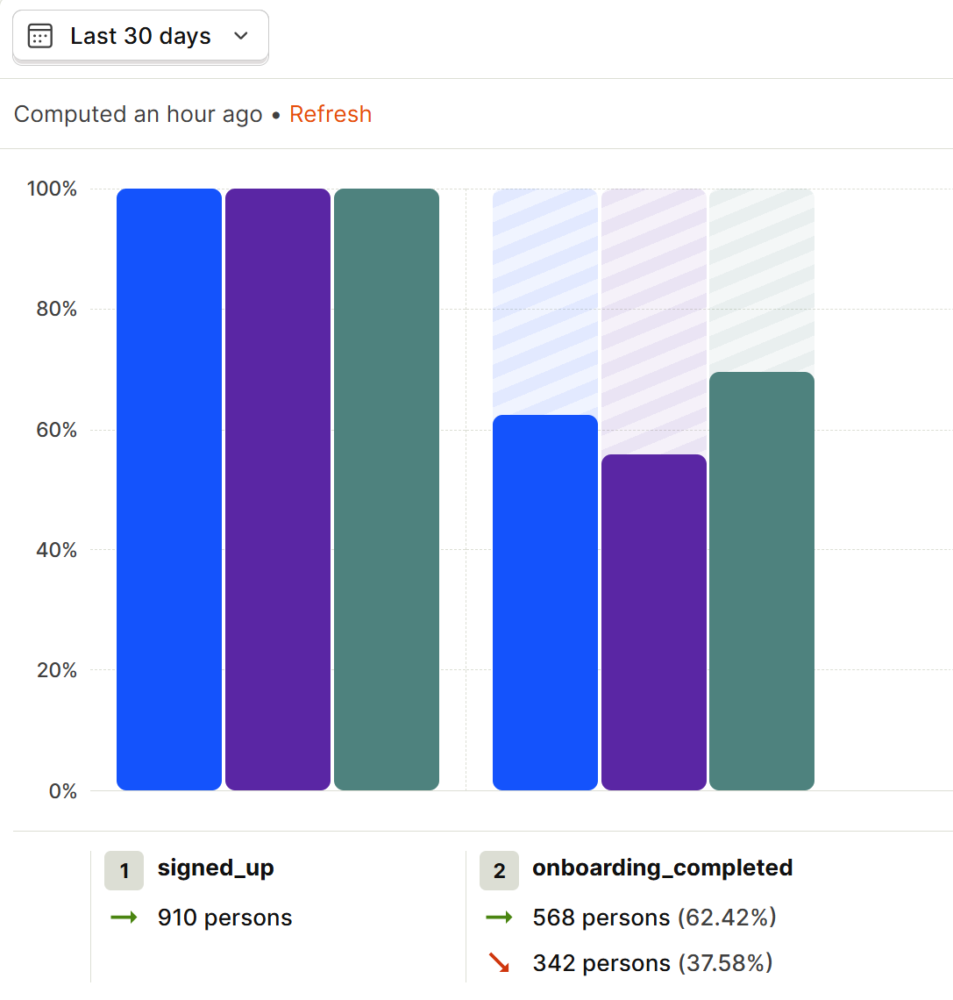
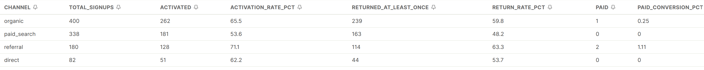

# TaskFlow — Product Analytics Case Study

> A portfolio project simulating the work of a first product analyst at a Series A B2B SaaS company. I designed the event schema, instrumented the product, generated 30 days of synthetic user behavior with deliberate patterns, and answered four PM questions using PostHog.

**🔗 Live dashboard:** [View in PostHog](https://eu.posthog.com/shared/SZ309XP-DHawyp3MxOVeJZUe7dWAOw)

**Tools:** PostHog (product analytics, HogQL), Python (event simulation), Git

---

## Executive summary

Four PM questions, four insights, four recommendations. The one-sentence story: **onboarding is the bottleneck, the users who get past it retain because they invite teammates, a simplified onboarding lifts activation by 24%, and paid budget should shift toward the referral channel that's already outperforming it.**

| # | Question | Insight | Recommendation |
|---|---|---|---|
| 1 | Where are we losing users before activation? | **40% of users drop off at onboarding.** Everything after onboarding converts at >95%. | Shorten or simplify onboarding. The product works — users just aren't reaching it. |
| 2 | Does inviting a teammate predict retention? | **Multiplayer users retain at 48% on Day 7 vs 7% for solo users — a ~6.6x lift.** | Move the team invite prompt to step 1 of onboarding. It's the single strongest retention lever in the data. |
| 3 | Does simplified onboarding lift activation? | **Treatment group activated at 69.5% vs control at 55.8% — a +13.6 percentage point lift (+24% relative).** | Ship treatment to 100% of new users. Combined with #2, expect Day 7 retention to rise ~5-7 pp. |
| 4 | Are paid-acquisition users worth it? | **Paid search users underperform on every metric — 12 pp lower activation, 12 pp lower return, zero paid conversions.** Referral traffic is the best channel by far. | Audit paid search targeting. Redirect budget into a formal referral program — referral is already outperforming every other channel organically. |

---

## The setup

**The scenario:** I'm the first product analyst at TaskFlow, a fictional B2B task-management SaaS. The PM asks me four questions about the product. This repo is my answer.

**The data:** 1,000 simulated users generating ~50,000 events across 30 days. Data is synthetic but structured with realistic patterns — see [`simulator.py`](./simulator.py) for the data-generating process. Events were ingested into PostHog using `historical_migration=True`.

**Why simulated data?** Product analytics is fundamentally about instrumentation, not just analysis. Designing an event schema, deciding what to track, and generating realistic behavior is a core skill I wanted to demonstrate end-to-end. Using a pre-built Kaggle dataset would have skipped the instrumentation half of the job.

---

## The event schema

I designed 19 events across 5 phases of the B2B SaaS user journey:

| Phase | Events |
|---|---|
| **Activation** | `signed_up`, `onboarding_started`, `onboarding_completed`, `project_created`, `task_created` |
| **Engagement** | `task_assigned`, `task_completed`, `task_commented`, `task_updated` |
| **Collaboration** | `member_invited`, `member_joined` |
| **Retention** | `session_started` |
| **Monetization** | `paywall_shown`, `paywall_upgrade_clicked`, `pricing_page_viewed`, `checkout_started`, `checkout_completed`, `subscription_activated` |
| **Churn** | `subscription_cancelled` |

**Design principles:**
- Every event is `object_verb` past tense (PostHog convention)
- Intentional actions over vanity metrics (`task_completed` not `task_viewed`)
- Paywall events use a `feature_name` property to avoid event explosion as new premium features are added
- `member_invited` and `member_joined` are separate events so invite acceptance rate can be measured

Full schema with properties: [`SCHEMA.md`](./SCHEMA.md)

---

## The four questions

### 1. Where are we losing users between signup and activation?

**Approach:** Built a 5-step activation funnel in PostHog.

**Insight:** 40% of users who start onboarding never complete it. Once past onboarding, the rest of the funnel is healthy — 96% of completers create a project, 99% of those create a task.

| Step | Users | Conversion |
|---|---|---|
| signed_up | 910 | 100% |
| onboarding_started | 872 | 95.8% |
| **onboarding_completed** | **542** | **59.6%** 🚨 |
| project_created | 464 | 51.0% |
| task_created | 459 | 50.4% |

**Recommendation:** Onboarding is the bottleneck, not the product itself. Users who get through it engage normally. This insight directly motivated the A/B test in Question 3.



---

### 2. Does inviting a teammate predict retention?

**Approach:** Created two cohorts — "Multiplayer Users" (invited ≥1 teammate) and "Solo Users" — then compared their Day 0-30 retention curves.

**Insight:** Users who invite at least one teammate retain at **48% on Day 7**. Solo users retain at just **7.3%**. That's a **~6.6x retention multiplier** — the single strongest predictor of retention in the dataset.

| Cohort | Size | Day 1 | Day 7 | Day 14 |
|---|---|---|---|---|
| **Multiplayer** (invited teammate) | 218 | 25.2% | **48.3%** | 47.5% |
| **Solo** (no invite) | 697 | ~7% | **7.3%** | ~5% |

**Recommendation:** Move the team invite prompt from later in onboarding to step 1. Every user who invites a teammate is worth roughly 6 solo users in retention terms. The "multiplayer threshold" is the single biggest lever available to the team.




---

### 3. Does simplified onboarding lift activation?

**Approach:** Analyzed an A/B test (50/50 split) comparing the existing onboarding flow (control) against a simplified version (treatment). Built a funnel broken down by `experiment_variant`.

**Insight:** Treatment wins convincingly.

| Group | Signups | Activated | Activation Rate |
|---|---|---|---|
| **Control** (existing) | 471 | 263 | 55.8% |
| **Treatment** (simplified) | 439 | 305 | **69.5%** |
| **Absolute lift** | | | **+13.6 pp** |
| **Relative lift** | | | **+24.4%** |

With n=910, the gap is well outside noise.

**Recommendation:** Ship treatment to 100% of new users. Combined with the retention finding above, I'd expect overall Day 7 retention to rise by ~5-7 percentage points.



---

### 4. Are paid-acquisition users worth it?

**Approach:** A question the UI can't easily answer — I needed to compare multiple cohorts across multiple metrics simultaneously. Wrote a HogQL query joining events to themselves by `person_id`, grouping by `acquisition_channel`, and computing activation rate, return rate, and paid conversion in one shot.

**Insight:** Paid search users underperform on every metric.

| Channel | Signups | Activation % | Return % | Paid Convert % |
|---|---|---|---|---|
| organic | 400 | 65.5% | 59.8% | 0.25% |
| **paid_search** | 338 | **53.6%** 🚨 | **48.2%** 🚨 | 0.00% |
| **referral** | 180 | **71.1%** ✨ | 63.3% | 1.11% |
| direct | 82 | 62.2% | 53.7% | 0.00% |

**Recommendation:** If paid_search CAC is comparable to organic, the unit economics are underwater — paid users cost the same to acquire but are 18% less likely to activate and 20% less likely to return. Redirect paid budget into a formal referral program, which is already outperforming every other channel organically.

Query: [`queries/channel_quality.sql`](./queries/channel_quality.sql)



---

## Tech notes

**Event ingestion:** Used PostHog's `historical_migration=True` mode to backfill 30 days of events. This mode routes events through a different ingestion pipeline optimized for backfills and doesn't count against standard ingestion quotas. Ran into — and documented — the SDK gotcha where backend events require explicit `$set` on the first event per user to create person profiles.

**Reproducibility:** `simulator.py` uses a fixed random seed (`SEED=42`), so the same run always produces the same data. Makes it possible to re-run and get identical results for screenshots/debugging.

**Patterns baked in:** The simulator deliberately encodes four patterns: a ~40% onboarding drop-off, a ~3x retention lift for multiplayer users (which compounded to ~6x in the final data), a ~15% A/B test lift, and worse retention for paid acquisition. This means the "findings" are not accidents — the project demonstrates methodology, not data luck.

---

## Running it yourself
```bash
# 1. Install dependencies
pip install posthog python-dotenv

# 2. Create .env file with your PostHog credentials
# POSTHOG_API_KEY=phc_...
# POSTHOG_HOST=https://eu.i.posthog.com

# 3. Test the pipe with 10 users first
python send_events.py 10

# 4. Run the full simulation
python send_events.py 1000
```

---

## About me

I'm Nidhi Gayatri Triplicane, a Data/Business Analyst based in Berlin. I previously worked at ZS Associates as a Decision Analytics Associate, specializing in commercial analytics and customer insights for large enterprise clients.

**Connect:** [LinkedIn](https://linkedin.com/in/gayatri-triplicane) · [GitHub](https://github.com/nidhi0908) · [Tableau Public](https://public.tableau.com/app/profile/gayatri.triplicane/vizzes)